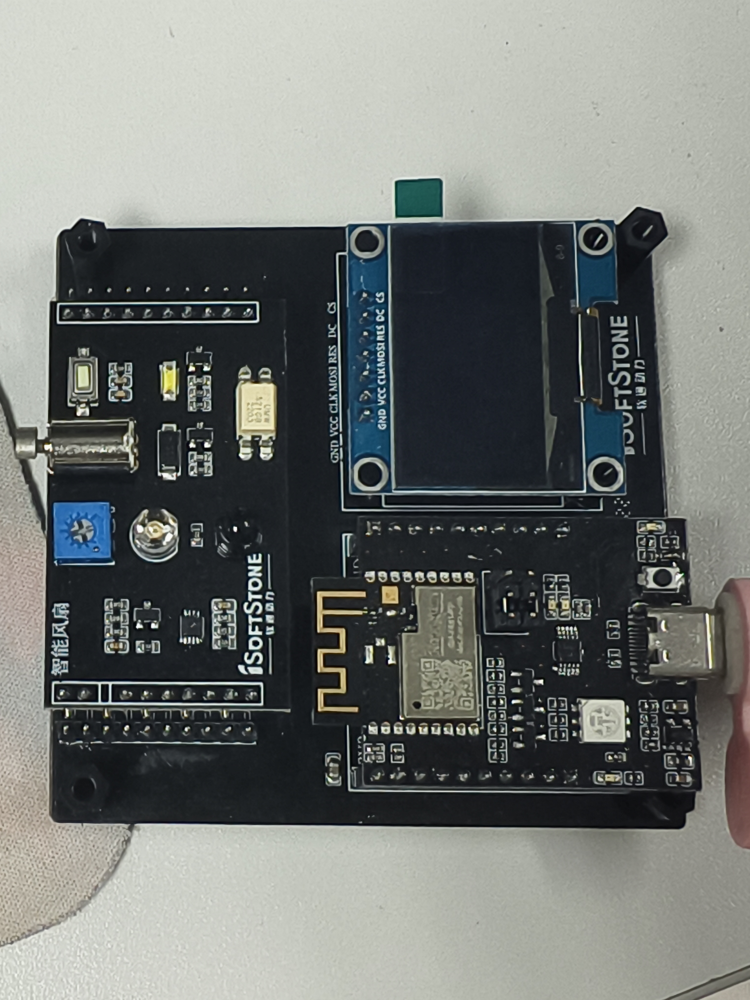
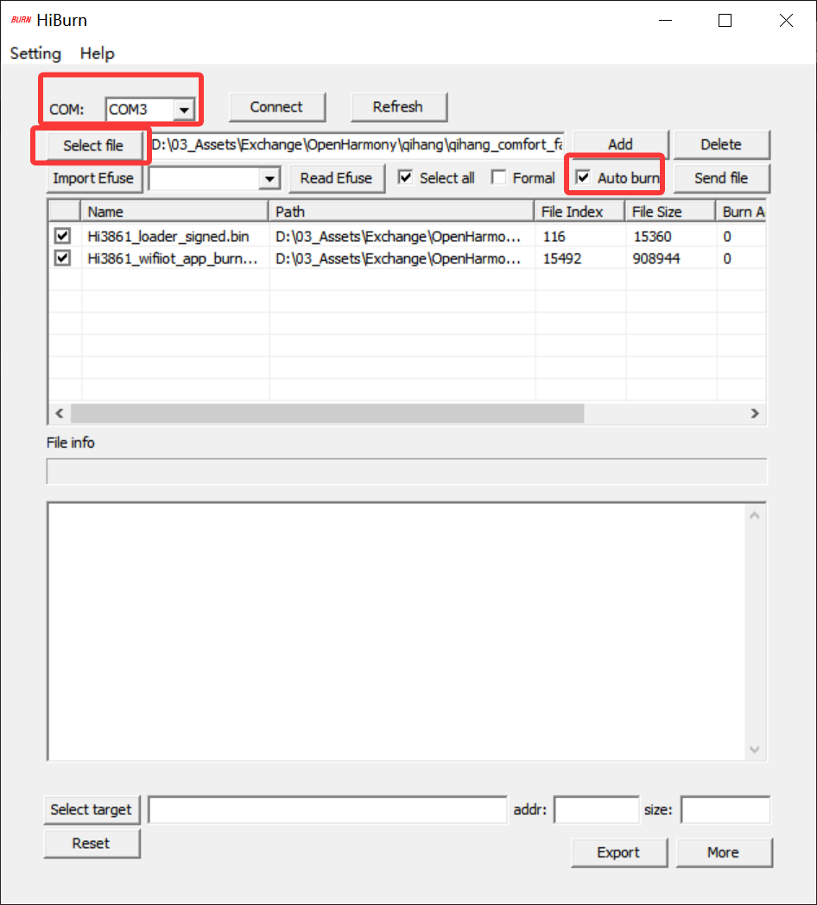

# OpenHarmony Hi3861 通用配置实操步骤

这是我整理的通用配置步骤，用来从零把 OpenHarmony Hi3861 环境跑起来。

如果第一次打开这个仓库，建议先看这篇。这里直接从准备硬件开始，一步一步做到：

```text
准备硬件
安装 Ubuntu 虚拟机
安装基础依赖
合并 qihang 适配层
首次 hb build 编译成功
HiBurn 烧录
Xshell 串口日志验证
```

这一轮跑通以后，再进入最终项目开发会轻松很多。

我当前验证过的组合：

```text
Windows 10 64 位
VMware Workstation
Ubuntu 20.04.6 Desktop 64 位
OpenHarmony-v3.2-Release
启航 Qihang / Hi3861 / LiteOS-M
RISC-V GCC 7.3.0
```

## 1. 准备硬件

先确认手上有这些东西：

```text
启航 Hi3861 开发板
Type-C 数据线
OLED / SHT30 / 风扇等课程设计模块
Windows 电脑
```

硬件模块大概长这样：


装好后的效果可以参考：



注意：Type-C 线必须支持数据传输。只能充电的数据线可能不会出现 COM 口，这个问题很常见。

## 2. 路径和分工

为了后面命令好复制，我建议统一用这些路径：

```text
Ubuntu 工作目录：/home/ohos/workspace
OpenHarmony 源码：/home/ohos/workspace/openharmony-3.2-release
```

大致分工：

```text
Windows：运行 HiBurn、查看串口、启动 MQTT、开发前端
Ubuntu：同步源码、配置工具链、编译固件
```

## 3. 安装 Ubuntu 虚拟机

推荐使用 Ubuntu 20.04.6 Desktop 64 位：[下载 ubuntu-20.04.6-desktop-amd64.iso](https://mirrors.tuna.tsinghua.edu.cn/ubuntu-releases/20.04/ubuntu-20.04.6-desktop-amd64.iso)

虚拟机推荐配置：

```text
CPU：4 核
内存：8 GB
磁盘：100 GB 或更多
网络：NAT
用户名：ohos
```

如果电脑内存只有 8 GB，可以改为：

```text
CPU：2 核
内存：4 GB
```

安装后建议创建工作目录：

```bash
mkdir -p "$HOME/workspace" "$HOME/tools" "$HOME/workspace/logs"
```

## 4. 安装基础依赖

Ubuntu 执行：

```bash
sudo apt update
sudo apt upgrade -y
sudo apt install -y \
  openssh-server \
  git \
  git-lfs \
  unzip \
  zip \
  wget \
  curl \
  rsync \
  build-essential \
  make \
  gcc \
  g++ \
  cmake \
  ninja-build \
  python3 \
  python3-pip \
  python3-venv
```

启用 Git LFS 和 SSH：

```bash
git lfs install
sudo systemctl enable --now ssh
sudo systemctl status ssh
```

成功标准：

```text
Active: active (running)
```

Windows PowerShell 测试 SSH：

```powershell
ssh ohos@192.168.XXX.XXX
```

Ubuntu IP 可用以下命令查看：

```bash
hostname -I
```

## 5. 安装 Python 依赖和 Repo

安装 Python 编译依赖：

```bash
python3 -m pip install --user --upgrade pip
python3 -m pip install --user \
  "scons>=3.0.4" \
  setuptools \
  "kconfiglib>=13.2.0" \
  pycryptodome \
  six \
  ecdsa
```

加入用户 PATH：

```bash
grep -q 'HOME/.local/bin' "$HOME/.bashrc" || \
echo 'export PATH="$HOME/.local/bin:$PATH"' >> "$HOME/.bashrc"
source "$HOME/.bashrc"
```

安装 Repo：

```bash
mkdir -p "$HOME/.local/bin"
curl -L https://raw.githubusercontent.com/GerritCodeReview/git-repo/main/repo \
  -o "$HOME/.local/bin/repo"
chmod +x "$HOME/.local/bin/repo"
repo --version
```

看到 `repo launcher version` 即可。

## 6. 同步 OpenHarmony 3.2 Release

创建源码目录：

```bash
mkdir -p "$HOME/workspace/openharmony-3.2-release"
cd "$HOME/workspace/openharmony-3.2-release"
```

初始化：

```bash
repo init \
  --repo-url=https://github.com/GerritCodeReview/git-repo \
  -u https://gitee.com/openharmony/manifest.git \
  -b refs/tags/OpenHarmony-v3.2-Release \
  --no-repo-verify
```

同步：

```bash
repo sync -c -j4
```

网络不稳定时降低并发：

```bash
repo sync -c -j2
repo sync -c -j1 --fail-fast
```

拉取 Git LFS：

```bash
mkdir -p "$HOME/workspace/logs"
set -o pipefail
repo forall -c 'git lfs pull' 2>&1 \
  | tee "$HOME/workspace/logs/openharmony-3.2-lfs.log"
echo "LFS result: ${PIPESTATUS[0]}"
```

成功标准：

```text
LFS result: 0
```

检查源码目录：

```bash
cd "$HOME/workspace/openharmony-3.2-release"
for dir in applications base build device foundation kernel third_party vendor
do
  test -d "$dir" && echo "OK $dir" || echo "MISSING $dir"
done
```

## 7. 合并 qihang 适配层

下载启航适配层压缩包：

```bash
cd "$HOME/workspace"
curl -L -o code-master.zip \
  "https://gitee.com/tianguantg/cqupt-ohos-hi3861-course-design/raw/master/resources/vendor-kits/启航KP_IOT智能开发套件/code-master.zip"
```

也可以直接在浏览器点击下载：

[下载 code-master.zip](https://gitee.com/tianguantg/cqupt-ohos-hi3861-course-design/raw/master/resources/vendor-kits/启航KP_IOT智能开发套件/code-master.zip)

下载后放到 Ubuntu 的 `$HOME/workspace` 目录即可。

解压并重命名：

```bash
mkdir -p hi3861-hello
unzip code-master.zip -d hi3861-hello
mv hi3861-hello/code-master hi3861-hello/qihang-overlay
```

确认适配层目录：

```bash
find "$HOME/workspace/hi3861-hello/qihang-overlay" \
  -maxdepth 3 -type d | sort
```

合并到 OpenHarmony 源码：

```bash
export ROOT="$HOME/workspace/openharmony-3.2-release"
export OVERLAY="$HOME/workspace/hi3861-hello/qihang-overlay"

rsync -av "$OVERLAY/device/" "$ROOT/device/"
rsync -av "$OVERLAY/vendor/" "$ROOT/vendor/"
```

成功后应存在：

```text
device/board/issedu/qihang
vendor/issedu/qihang
```

## 8. 补充 BearPi HAL

启航配置依赖：

```text
vendor/bearpi/bearpi_hm_nano/hals
```

创建 local manifest：

```bash
cd "$HOME/workspace/openharmony-3.2-release"
mkdir -p .repo/local_manifests
cat > .repo/local_manifests/qihang-dependencies.xml <<'EOF'
<?xml version="1.0" encoding="UTF-8"?>
<manifest>
  <remote
      name="qihang-gitee"
      fetch="https://gitee.com/openharmony/" />

  <project
      name="vendor_bearpi"
      path="vendor/bearpi"
      remote="qihang-gitee"
      revision="aa0a2f91e2ec27ea641db7c4748094b817d18599" />
</manifest>
EOF
```

同步：

```bash
repo sync vendor/bearpi -j1 --fail-fast
```

验证：

```bash
git -C vendor/bearpi rev-parse HEAD
test -d vendor/bearpi/bearpi_hm_nano/hals && echo "OK BearPi HAL"
```

成功标准：

```text
aa0a2f91e2ec27ea641db7c4748094b817d18599
OK BearPi HAL
```

## 9. 修复 sys_installer_lite 配置

OpenHarmony 3.2 Release 中没有旧配置引用的 `updater/sys_installer_lite`，需要删除该组件。

备份：

```bash
cd "$HOME/workspace/openharmony-3.2-release"
cp -a vendor/issedu/qihang/config.json \
  vendor/issedu/qihang/config.json.before-remove-sys-installer-lite
```

删除旧组件：

```bash
python3 - <<'PY'
import json
from pathlib import Path

path = Path("vendor/issedu/qihang/config.json")
data = json.loads(path.read_text(encoding="utf-8"))

new_subsystems = []
removed = False
for subsystem in data.get("subsystems", []):
    if subsystem.get("subsystem") != "updater":
        new_subsystems.append(subsystem)
        continue

    components = [
        item for item in subsystem.get("components", [])
        if item.get("component") != "sys_installer_lite"
    ]
    removed = removed or len(components) != len(subsystem.get("components", []))
    if components:
        subsystem["components"] = components
        new_subsystems.append(subsystem)

if not removed:
    raise SystemExit("sys_installer_lite not found")

data["subsystems"] = new_subsystems
path.write_text(json.dumps(data, ensure_ascii=False, indent=2) + "\n", encoding="utf-8")
PY
```

验证：

```bash
python3 -m json.tool vendor/issedu/qihang/config.json >/dev/null && echo "JSON OK"
grep -nE 'sys_installer_lite|"subsystem"[[:space:]]*:[[:space:]]*"updater"' \
  vendor/issedu/qihang/config.json
```

成功标准：

```text
JSON OK
```

并且 `grep` 无输出。

## 10. 安装编译工具链

下载 OpenHarmony 预编译工具：

```bash
cd "$HOME/workspace/openharmony-3.2-release"
set -o pipefail
bash build/prebuilts_download.sh 2>&1 \
  | tee "$HOME/workspace/logs/prebuilts-download.log"
echo "Prebuilts result: ${PIPESTATUS[0]}"
```

成功标准：

```text
Prebuilts result: 0
```

安装 Hi3861 RISC-V GCC 7.3.0：

```bash
mkdir -p "$HOME/tools"
cd "$HOME/tools"
wget -c https://repo.huaweicloud.com/harmonyos/compiler/gcc_riscv32/7.3.0/linux/gcc_riscv32-linux-7.3.0.tar.gz
tar -xzf gcc_riscv32-linux-7.3.0.tar.gz
```

加入 PATH：

```bash
grep -qxF 'export PATH="$HOME/tools/gcc_riscv32/bin:$PATH"' ~/.bashrc \
  || echo 'export PATH="$HOME/tools/gcc_riscv32/bin:$PATH"' >> ~/.bashrc
source ~/.bashrc
hash -r
```

安装 HB：

```bash
cd "$HOME/workspace/openharmony-3.2-release"
python3 -m pip install --user build/lite
source ~/.bashrc
hash -r
```

验证：

```bash
which riscv32-unknown-elf-gcc
riscv32-unknown-elf-gcc --version
which hb
hb -h
```

## 11. 选择 qihang 产品

进入源码目录：

```bash
cd "$HOME/workspace/openharmony-3.2-release"
hb set -root .
hb set
```

交互界面选择：

```text
issedu
└── qihang
```

查看环境：

```bash
hb env
```

重点确认：

```text
product: qihang
board: qihang
kernel: liteos_m
product path: vendor/issedu/qihang
device path: device/board/issedu/qihang
```

## 12. 首次编译 HelloWorld / qihang

执行：

```bash
export PATH="$HOME/.local/bin:$HOME/tools/gcc_riscv32/bin:$PATH"
cd "$HOME/workspace/openharmony-3.2-release"
hb build -f
```

成功标准：

```text
qihang build success
Build result: 0
```

生成固件：

```text
out/qihang/qihang/Hi3861_wifiiot_app_allinone.bin
```

首次完整烧录优先使用：

```text
Hi3861_wifiiot_app_allinone.bin
```

## 13. 复制固件到 Windows

Windows PowerShell 使用 `scp`：

```powershell
scp ohos@192.168.XXX.XXX:/home/ohos/workspace/openharmony-3.2-release/out/qihang/qihang/Hi3861_wifiiot_app_allinone.bin "C:\OpenHarmony\share\"
```

## 14. HiBurn 烧录

首先回到 Windows 主机，确认开发板 COM 口：

```text
右键开始菜单 → 设备管理器 → 端口（COM 和 LPT）
```

用 Type-C 数据线连接电脑和开发板，查看端口列表中新出现的 COM 口（例如 `COM3`）。

如果没有新出现的 COM 口：

1. 检查 VMware 是否有 USB 弹窗，点击关掉它
2. 如果仍然没有，下载并安装 CH341 驱动程序：[下载 CH341SER.EXE](https://gitee.com/tianguantg/cqupt-ohos-hi3861-course-design/raw/master/resources/tools/CH341SER.EXE)

安装驱动后重新插拔数据线，再次查看设备管理器。

下载 HiBurn 烧录工具：[下载 HiBurn.exe](https://gitee.com/tianguantg/cqupt-ohos-hi3861-course-design/raw/master/resources/tools/HiBurn.exe)

HiBurn 操作参考：



标准流程：

```text
打开 HiBurn.exe
选择设备管理器中新出现的 COM 口
点击 Select file，选择 Hi3861_wifiiot_app_allinone.bin
勾选 Auto burn
点击 Connect
按下开发板 Reset
等待烧录完成
点击 Disconnect
```

注意：烧录完成后必须点击 `Disconnect`，否则 Xshell 可能无法打开同一个串口。

## 15. Xshell 查看串口日志

下载 Xshell（家庭/学校版免费）：[下载 Xshell](https://www.xshell.com/zh/free-for-home-school/)

Xshell 新建会话：

```text
协议：Serial
端口号：设备管理器中新出现的 COM 口
波特率：115200
数据位：8
停止位：1
校验：None
流控：None
```

连接后按开发板 `Reset`。

成功标准：

```text
串口窗口出现启动日志
无乱码
能看到系统启动、应用启动或 HelloWorld/qihang 相关输出
```

如果乱码，优先检查波特率是否为 `115200`。

## 16. 首次闭环完成后继续最终项目

到这里说明基础环境已经跑通：

```text
源码同步成功
qihang 产品选择成功
hb build -f 编译成功
allinone 固件生成成功
HiBurn 烧录成功
Xshell 串口日志正常
```

继续完成舒适风扇最终项目：

最终项目阶段请使用自己重新编译生成的固件：

```text
out/qihang/qihang/Hi3861_wifiiot_app_allinone.bin
```

## 17. 常见问题

`repo sync` 失败：

```bash
repo sync -c -j2
repo sync -c -j1 --fail-fast
```

`riscv32-unknown-elf-gcc: not found`：

```bash
export PATH="$HOME/tools/gcc_riscv32/bin:$PATH"
source ~/.bashrc
hash -r
```

`Component "sys_installer_lite" not found`：

```text
回到第 9 节，删除 updater/sys_installer_lite。
```

HiBurn 找不到串口：

```text
确认 VMware 没有拦截 USB 设备
下载并安装 CH341 驱动（见第 14 节）
重新插拔开发板后查看设备管理器
```

Xshell 打不开串口：

```text
确认 HiBurn 已点击 Disconnect
确认没有其他串口工具占用同一个 COM 口
```

不要做的事：

```text
不要使用 sudo hb build
不要提交真实 network_config.h
不要复制终端提示符 ohos@ohos-vm:~$
```

旧版完整施工记录已归档到：[01_通用配置步骤_原始记录](../../archive/docs/01_通用配置步骤_原始记录.md)
